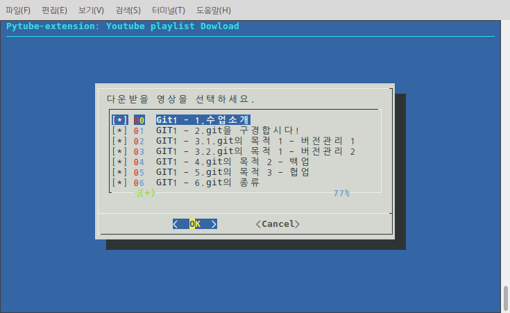

# pytube: playlist download helper
## 소개

[Youtube](https://youtube.com) 재생목록을 한 번에 다운로드 할 수 있게 도와주는 프로그램입니다.  python 라이브러리 [pytube](https://github.com/nficano/pytube) 의 강력한 기능을 그대로 확장하여 사용 하실 수 있습니다.  

<a href=""></a>

## 환경

* python 3.x 이상
* [pytube 9.2.2](https://github.com/nficano/pytube)
* [python dialog 3.4.0 ](http://pythondialog.sourceforge.net)


## 사용법

1. playlistDailog 를 실행 합니다.

```shell
$ python3 playlistDailog.py
```

2. 다운받을 플레이리스트의 주소를 입력합니다.
   <a href=""></a>


3. 저장 받을 위치를 입력합니다. 현재 위치가 기본으로 되어 있습니다.
   <a href=""></a>

4. 목록을 확인하며 다운 받을 영상을 선택합니다.
   <a href=""></a>

5. 다운로드!!
   <a href=""></a>


## 알려진 버그

* 윈도우 환경에서 한글 동영상 다운로드 시 자소분리 현상
* 목록이 길어질때 화면이 깜빡이는 현상